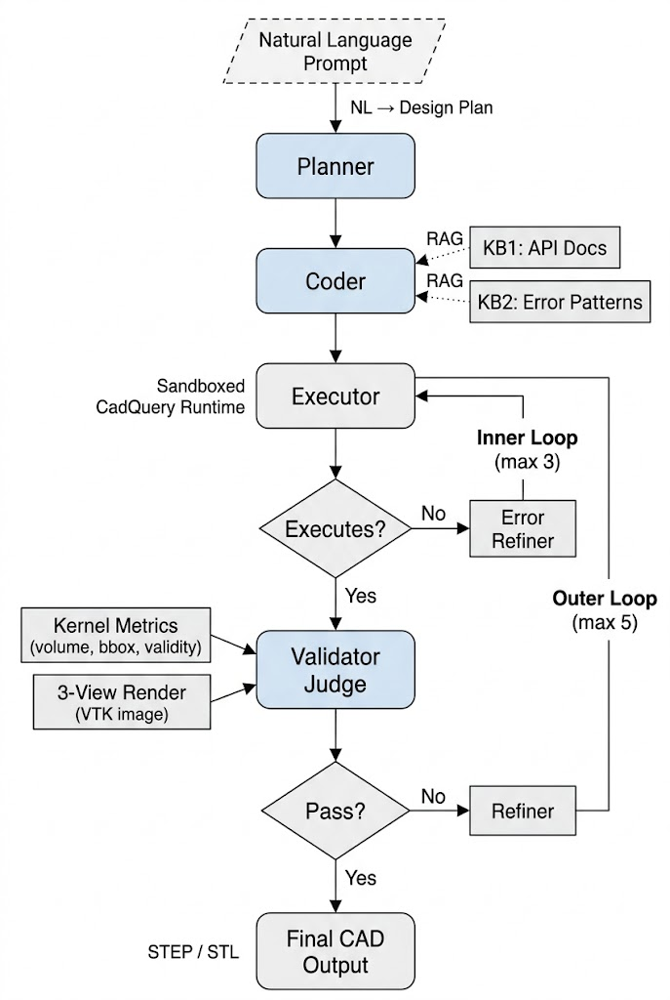
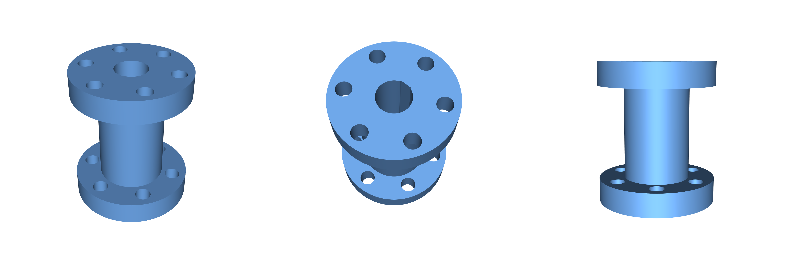
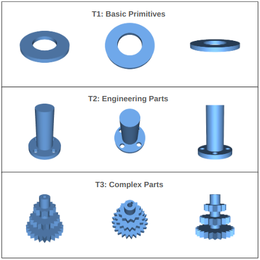
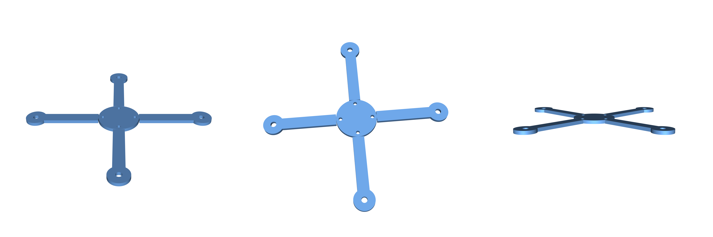

# AutoFab

**Multi-agent CAD generation with programmatic geometric validation.**

AutoFab takes a natural language description of a 3D part and produces manufacturing-ready CAD geometry. It works by having multiple LLM agents collaborate — one plans, one writes CadQuery code, one validates the geometry using real measurements from the CAD kernel, and one refines the code when something is off. The result is a closed loop that iterates until the part is dimensionally correct, not just visually plausible.



## Why This Exists

Current text-to-CAD systems either generate in a single pass with no verification, or use visual feedback that can't resolve millimeter-scale dimensional errors. A part that *looks* right but has a 3mm bounding box error is useless for manufacturing.

AutoFab combines two things that prior work kept separate:
- **Exact geometric measurements** from the OpenCASCADE kernel (bounding box, volume, face counts, solid validity)
- **Visual inspection** from a vision-language model that looks at three rendered views of the part

This gives the system both the numerical precision to fix dimensional errors and the high-level shape awareness to catch when a part is structurally wrong.

## How It Works

The pipeline has five agents and two nested correction loops:

1. **Planner** — Converts the prompt into a structured design spec (components, dimensions, constraints)
2. **Coder** — Generates CadQuery Python code, augmented with retrieval over API documentation
3. **Executor** — Runs the code in a sandboxed subprocess, extracts geometry from the OCCT kernel, exports STEP/STL
4. **Validator** — Checks solid validity, then an independent vision-language model Judge cross-references the prompt, code, kernel metrics, and a three-view render to decide pass/fail
5. **Refiner** — When validation fails, receives the exact feedback and fixes the code

The **inner loop** handles execution errors (bad code → error refiner → retry, up to 3 times). The **outer loop** handles geometric errors (wrong shape → validator feedback → refiner → re-execute, up to 5 iterations).

The Judge uses Claude Opus — a stronger model than the Sonnet used for code generation — so it's not just grading its own homework.

### What the Vision Judge Sees

At each iteration, the validator renders three views of the generated part and sends them to the Judge alongside the kernel metrics:



Left: isometric view for overall shape. Center: high-angle rear view revealing top-face features like bolt holes and bores. Right: front profile showing vertical structure. The Judge cross-references what it sees here against the prompt and the exact measurements to catch failures that numbers alone would miss.

## Benchmark

We evaluate on 100 hand-written prompts across three difficulty tiers:



- **T1 — Primitives** (50 entries): Boxes, cylinders, cones, tori. One to three operations each.
- **T2 — Engineering Parts** (25 entries): Brackets, flanges, gears, plates with hole patterns. Three to eight operations.
- **T3 — Complex Parts** (25 entries): Multi-feature parts with lofts, sweeps, shells, revolves, multi-body unions. Five to fifteen operations.

Every reference script was written by hand, executed, and visually inspected — not LLM-generated.

## Results

All metrics computed in absolute millimeter space with ICP alignment. This means dimensional accuracy matters, not just shape similarity.

| Configuration | Exec % | CD (median) | CD (mean) | F1 (median) | IoU (median) |
|---|---|---|---|---|---|
| Zero-shot (single LLM call) | 95% | 0.55 | 28.37 | 0.9707 | 0.8085 |
| Full pipeline, no vision | 99% | 0.48 | 18.19 | 0.9792 | 0.9563 |
| **Full pipeline with vision** | **100%** | **0.48** | **0.74** | **0.9846** | **0.9629** |

The big number: **38x reduction in mean Chamfer Distance** compared to zero-shot. The mean (not median) is what matters here — it captures the catastrophic failures that the refinement loop fixes.

Vision is especially critical on complex parts (T3): removing it increases T3 mean Chamfer Distance from 1.42 to 49.68.

### Where It Still Fails



This quadcopter frame (T3\_019) scored F1 = 0.963 and IoU = 0.985 — it passed all validation checks. But there are small gaps between the arms and the central hub that neither the kernel metrics nor the three fixed views could detect. This is the kind of near-miss that would need adaptive view selection or higher-resolution crops to catch.

## Project Structure

```
autofab/
  pipeline.py      # Main pipeline orchestration (Planner → Coder → Executor → Validator → Refiner loop)
  agents.py        # All LLM agent definitions (Planner, Coder, Error Refiner, Judge, Refiner)
  executor.py      # Sandboxed subprocess execution, OCCT geometry extraction, STEP/STL export
  validator.py     # Solid validity check + LLM-as-Judge with optional vision
  render.py        # VTK three-view rendering (isometric, high-angle rear, front profile)
  metrics.py       # Chamfer Distance, F1, Volumetric IoU against reference STLs
  rag_kb1.py       # RAG knowledge base: 155 CadQuery API entries + 28 worked examples
  rag_kb2.py       # RAG knowledge base: 25 error-solution patterns for common failures

scripts/
  run_custom_benchmark.py     # Full pipeline benchmark on the 100-entry dataset
  run_zeroshot_baseline.py    # Zero-shot baseline (single LLM call, no agents)
  analyze_results.py          # Load results, compute summaries, compare to baselines

data/dataset_v2/
  t1_primitives.jsonl          # 50 basic shape prompts with reference CadQuery code
  t2_engineering_parts.jsonl   # 25 engineering part prompts with reference code
  t3_complex_parts.jsonl       # 25 complex part prompts with reference code

run.py             # Quick single-prompt entry point
requirements.txt   # Python dependencies
```

## Setup

AutoFab uses CadQuery, which needs a conda environment:

```bash
conda create -n cadquery python=3.10
conda activate cadquery
conda install -c cadquery -c conda-forge cadquery=master
pip install -r requirements.txt
```

VTK is required for the three-view rendering:
```bash
pip install vtk
```

Set your Anthropic API key:
```bash
echo "ANTHROPIC_API_KEY=your-key-here" > .env
```

## Usage

### Run on a single prompt

```bash
python run.py "A rectangular plate 80mm x 60mm x 4mm with four M3 holes in a 70x50mm pattern"
```

This runs the full pipeline (plan → code → execute → validate → refine) and saves STEP/STL files to `outputs/`.

### Run the benchmark

```bash
# Full pipeline with vision (all 100 entries)
python scripts/run_custom_benchmark.py --experiment-name my_run --verbose

# Just T3 (complex parts)
python scripts/run_custom_benchmark.py --experiment-name my_t3 --tiers T3 --verbose

# Zero-shot baseline for comparison
python scripts/run_zeroshot_baseline.py --experiment-name my_zeroshot
```

Results are saved to `results/<experiment-name>/results.jsonl`.

### Analyze results

```bash
python scripts/analyze_results.py
```

## Models Used

- **Code generation** (Planner, Coder, Error Refiner, Refiner): Claude Sonnet
- **Validation Judge**: Claude Opus — independent from the generation agents to avoid self-confirmation bias

## Citation

Paper link coming soon.

## Authors

Jesse Barkley, Rumi Loghmani, Amir Faramani — Carnegie Mellon University, Department of Mechanical Engineering
